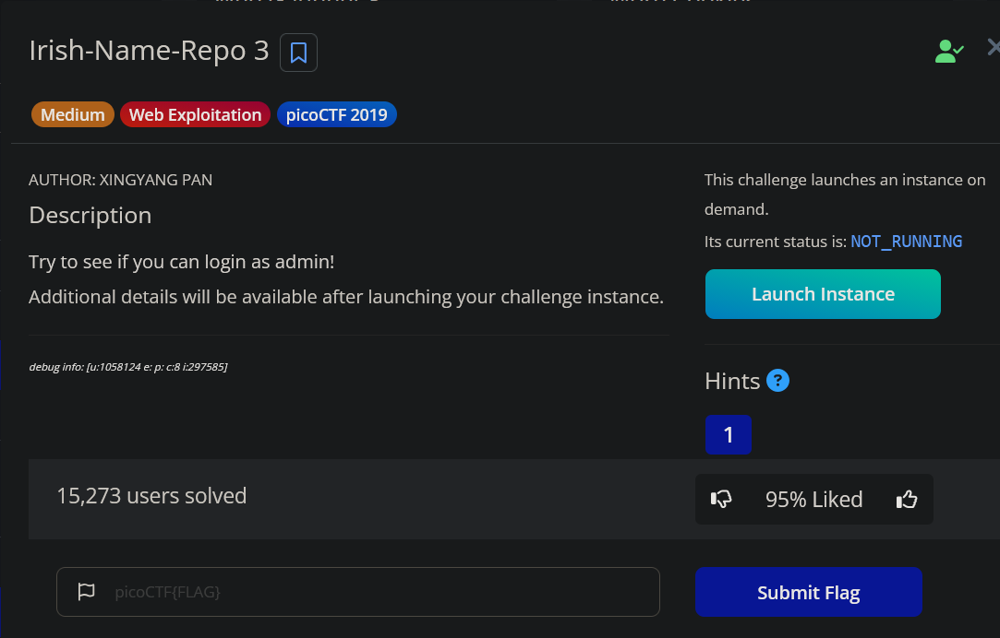
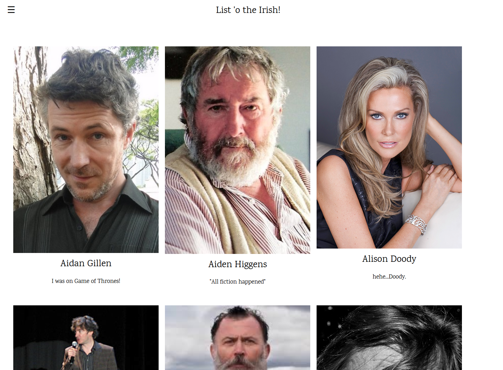
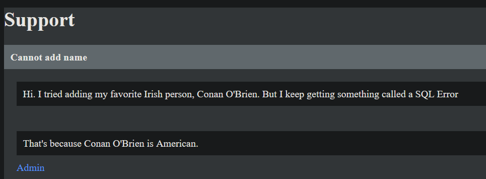
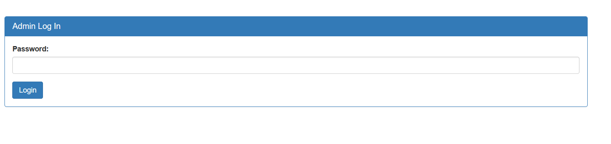

# Irish-Name-Repo 3

### Challenge Information:



### Exploitation

The challenge requires logging in as admin to solve. The website lists some famous Irish people (I think Idk any of them).



The menu has 2 options: `support` and `admin login`. As part of recon, I viewed support first, which was a Q&A between site admin and the users. This interaction was quite hilarious and also gave a valuable insight. 



SQLi was going to be my first attempt if I had not found anything else, so this worked out fine. 



I tried the classic check for SQLi, even though it is already confirmed, by passing `'` and the site does throw an error. 

The next thing to do was attempt the injection via `' or '1'='1'--`  .

But this also gives us an error.

```html
Warning: SQLite3::query(): Unable to prepare statement: 1, near "be": syntax error in /var/www/html/login.php on line 20

Fatal error: Uncaught Error: Call to a member function fetchArray() on boolean in /var/www/html/login.php:21 Stack trace: #0 {main} thrown in /var/www/html/login.php on line 21
```

The error talks about “be”. Where did that come from??? Maybe I mistyped, so I tried it again and got the same result. There is no SQL commands involving “be”, so it was possible that the site was changing the input. If “or” and “be” are analyzed closely, it can be found that “o” is 13 positions away from “b” and the same goes for “r” and “e”. This is a classic cipher known as `ROT-13`. 

Since the server was rotating input 13 spaces, if “be” was input, it would be “or”. So the new payload becomes `' be '1'='1'--` .  

```html
Logged in!

Your flag is: picoCTF{REDACTED} 
```

And thats the flag.
