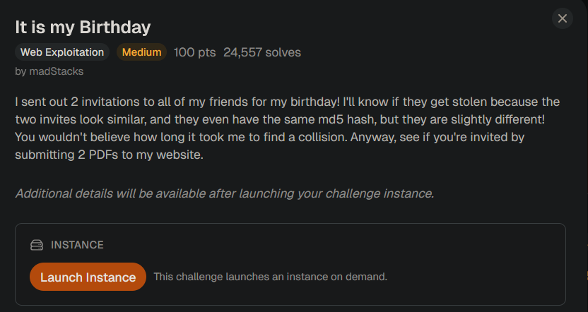
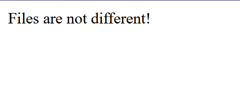
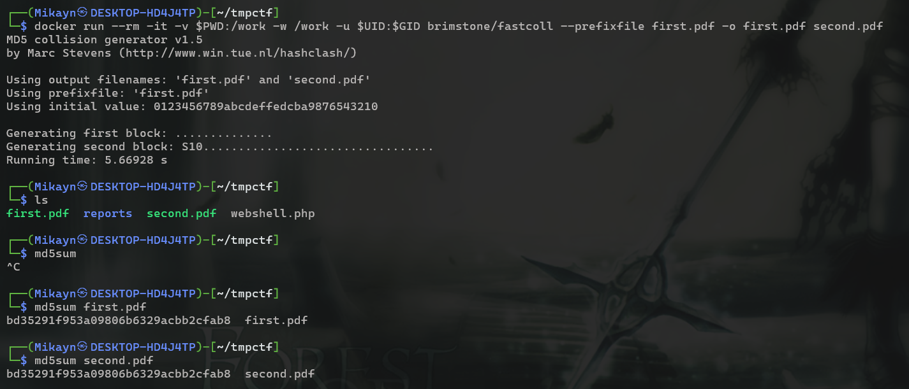

# It is my Birthday

## Challenge Description:



## Reconnaissance

The instance shows a place to input 2 files. I assume the server checks the `MD5` hash of these files, and if it matches, the person is invited to the birthday. So this is a `MD5 Collision Attack`. 


But if the files are the same, their hash should match. So I uploaded the same PDF twice. 



Seems like the check is quite thorough. 

## MD5 Collision Attack

`MD5` is a one way hash function just like `SHA-256, SHA-512, bcrypt, etc.` 

One way hash function is basically a very secure way of encrypting information. For security, one way hash functions should follow the given properities:

1. Must be easy to compute, but should be practically impossible to decrypt. 
2. Small change in input results in a large change in output (Avalance effect).
3. No 2 inputs should give the same hash (Collision resistance). 
4. Same input always gives the same output. 

Although MD5 is still a one way hash function, it is not considered cryptographically secure anymore. It is possible to create two difference inputs such that their MD5 hashes match. Thus, the “collision resistence” property can be said to be broken. 

### Fake Scenario

Suppose a company hashes files using MD5. An attacker could create 2 files: a harmless file, file 1 and a malicious file, file 2. Taking file 1’s MD5 hash, the attacker could force the MD5 hash of file 2 to also be the same hash. 

Now, when the normal file is uploaded to the company, its MD5 hash is stored. But when the attacker uploads the malicious file, the hashes collide. This could break the system, or quietly replace the harmless file with the malicious file. 

### Challenge

Now that MD5 collision is clear, it is time to move back to the challenge. I used brimstone’s fastcoll    (https://github.com/brimstone/fastcoll) to generate two pdfs with the same MD5 hash. 



Both `first.pdf` and `second.pdf` have the same MD5 hash. If I upload this to the website, I should get the invitation to the birthday party aka the flag. 

Uploading them gives the source code of `index.php` where the flag is neatly commented out. 

```php
<?php

if (isset($_POST["submit"])) {
    $type1 = $_FILES["file1"]["type"];
    $type2 = $_FILES["file2"]["type"];
    $size1 = $_FILES["file1"]["size"];
    $size2 = $_FILES["file2"]["size"];
    $SIZE_LIMIT = 18 * 1024;

    if (($size1 < $SIZE_LIMIT) && ($size2 < $SIZE_LIMIT)) {
        if (($type1 == "application/pdf") && ($type2 == "application/pdf")) {
            $contents1 = file_get_contents($_FILES["file1"]["tmp_name"]);
            $contents2 = file_get_contents($_FILES["file2"]["tmp_name"]);

            if ($contents1 != $contents2) {
                if (md5_file($_FILES["file1"]["tmp_name"]) == md5_file($_FILES["file2"]["tmp_name"])) {
                    highlight_file("index.php");
                    die();
                } else {
                    echo "MD5 hashes do not match!";
                    die();
                }
            } else {
                echo "Files are not different!";
                die();
            }
        } else {
            echo "Not a PDF!";
            die();
        }
    } else {
        echo "File too large!";
        die();
    }
}

// FLAG: picoCTF{REDACTED}

?>
```

The code checks if the files are same which gave the error I got in the beginning lol.