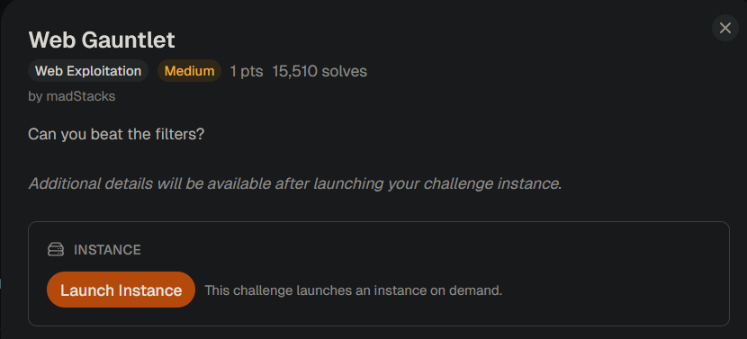
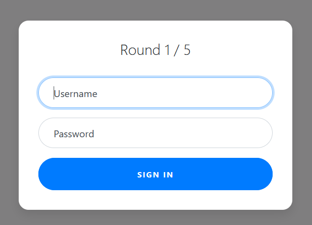
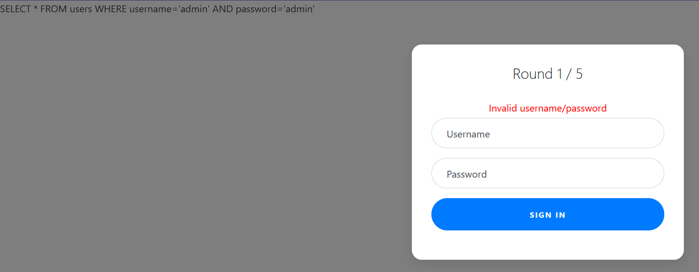
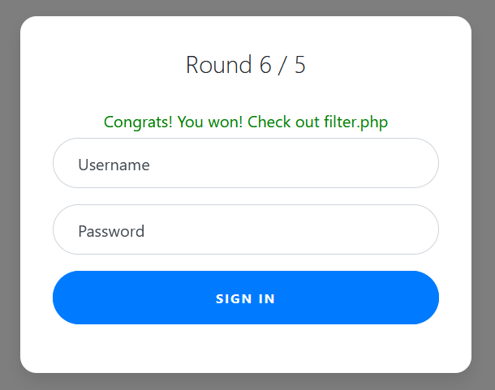

# Web Gauntlet

## Challenge Description:



## Exploitation

Upon starting the instance, we are given two links. One is the default link and the other is the `filter.php` endpoint. This has 5 rounds and hte goal is to login as “admin” in all 5 logins. The `filter.php` tells what is filtered in the login page in every round. 

### Round 1:

The default endpoint shows a login page.



I was curious as to what the `filter.php` endpoint was, so I checked it out in the beginning. Turns out the filter is “or” for round 1.

I tried `admin:admin` first to see what the error message is like, and it turns out the site outputs the SQL query as well. Not very realistic now, are we. 



This round was a breeze anyways. The input that works is `admin'--`. `--` comments out anything after it, so the check for password (`AND password='a'`) becomes nonexistent. This means the program only checks whether the username is correct, and if it is so, the login is successful. 

```sql
SELECT * FROM users WHERE username='admin'-- ' AND password='a' 
```

### Round 2:

From this round onwards, I try and not check `filter.php` at the start. Trying the same input as before (`admin'--` ) does not give any output (not even the invalid username/ password from before). This makes me think comments are filtered. 

When I only send the comments i.e. `--`, it also gives no output. I tried `admin' or '1'='1` next in case the filtering from the previous round was removed, but unfortunately it was not. 

All these tests were done on the username field. What about the password field then? That was also filtered oof. 

But SQL also has another type of comments: `/* ... */`. So I tried the payload `admin' /*`. And it works. This is similar to the previous round where the check for password was ignored. 

```sql
SELECT * FROM users WHERE username='admin' /*' AND password='a' 
```

### Round 3:

I tried the same payload as above for good measure and it is also filtered. 

I used the `IN` operator but it also gives no output. I tried some other payloads but it gave no leads. Seems like the filter blocks a mjority of operators and functions.

But there is another way to bypass without any operators. If the query ends after admin, the check for password is also ignored. So the payload becomes `admin';` which ends the query at that point.

```sql
SELECT * FROM users WHERE username='admin';' AND password='a' 
```

### Round 4:

As usual, the same payload above also is filtered. I assume its the `;` this time around. 

I tried a lot more payloads, but all of them were filtered. I was truly stuck so I decided to check out `filter.php`. 

```
Round4: or and = like > < -- admin
```

Bruh. No wonder my payloads were all being filtered. 

I tried `;` alone, and that is not filtered. So this just got a LOT easier. I assume the check specifically checks for `admin`, which means the filter is possible to bypass using string concatenation. In sqlite, `||` is used to concatenate strings. So the payload becomes `admi'||'n';` which passes me to the final round. 

```sql
SELECT * FROM users WHERE username='admi'||'n';' AND password='a' 
```

### Round 5:

As usual, I tried the same payload as previous round and… WHAT? It actually worked this time? 

```sql
SELECT * FROM users WHERE username='admi'||'n';' AND password='a' 
```



So I checked `filter.php` and it contains the php code used to filter each round. At the bottom, there is the flag in plaintext.